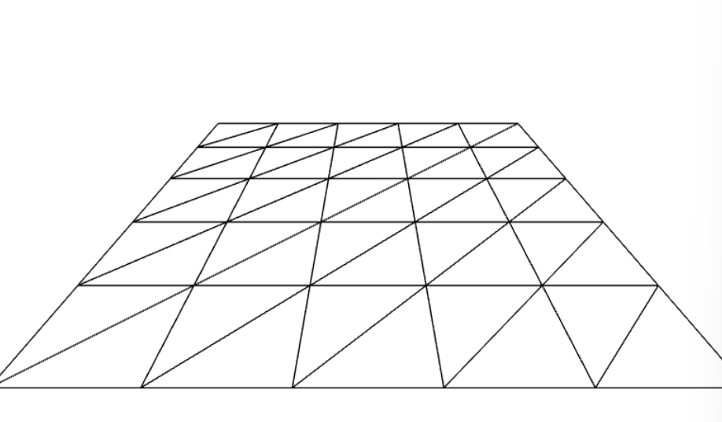

# object와 Scroll event 연동

Plane Mesh 뿐 아니라 모든 Mesh가 여러 삼각형의 합으로 이루어져있음

```
  const waveGeometry = new THREE.PlaneGeometry(5, 5, 5, 5);
  const waveMaterial = new THREE.MeshStandardMaterial({
    wireframe: true,
  });
  const wave = new THREE.Mesh(waveGeometry, waveMaterial);
// x 축으로 살짝 눕히게
  wave.rotation.x = -(Math.PI / 3);
```



## 파도만들기

두 가지 방식이 있음

1. 위 이미지의 각 정점들이 있는데, 그 정점의 z 좌표 값을 조절해주어 파도처럼 보이도록 만들어 준다.

   - waveGeometry.attributes.position.array : 각 정점들의 좌표정보를 가지고 있음 [x, y, z, x, y, z, ...]

```
  //더 많은 정점을 위해 Segments값도 150으로 크게
  const waveGeometry = new THREE.PlaneGeometry(1500, 1500, 150, 150);
  const waveMaterial = new THREE.MeshStandardMaterial({
    wireframe: true,
    color: "#00ffff",
  });
  const wave = new THREE.Mesh(waveGeometry, waveMaterial);

  // 90도로 완전히 눕힘
  wave.rotation.x = -(Math.PI / 2);

 const waveHeight = 2.5;
  for (let i = 0; i < waveGeometry.attributes.position.array.length; i += 3) {
    //각 정점의 z좌표만 변경
    // Math.random() : 0 ~ 1사이의 랜덤값 반환 , -0.5를 하여 -0.5 ~ 0.5 사이의 값을 반환하도록, 그리고 대략적인 값으로(waveHeight)  파도높이의 범위 설정
    waveGeometry.attributes.position.array[i + 2] += (Math.random() - 0.5) * waveHeight;
  }
  scene.add(wave);
```

2. 위의 코드에서 array.length 대신 count사용, getZ/setZ 이용
   - count : 정점의 갯수

```
const waveHeight = 2.5;
  for (let i = 0; i < waveGeometry.attributes.position.count; i++) {
    const z =
      waveGeometry.attributes.position.getZ(i) +
      (Math.random() - 0.5) * waveHeight;
    waveGeometry.attributes.position.setZ(i, z);
```

## 안개 생성

- scene.fog라는 속성을 통해 설정

1. new THREE.Fog()

   - color : 안개 색상
   - near/ far : 안개를 카메라로부터 얼만큼 가까운 거리, 먼 거리까지 적용할 것 인지

```
  scene.fog = THREE.Fog(0xf0f0f0, 0.1, 500);
```

2. new THREE.FogExp2()

   - 카메라 근처에서 시야가 옅게 보이다가 카메라에서 멀어질 수록 거듭제곱 지수함수(FogExp2())만큼 기하급수적으로 안개가 짙어지는 효과
   - 현실적인 느낌의 안개설정 가능

   * 그렇지만 안개의 범위를 직접 지정할 수 있는 위에꺼를 더 많이 사용한다고 함

   * color : 안개 색상
   * density : 안개의 밀도

```
  scene.fog = new THREE.FogExp2(0xf0f0f0, 0.005);
```

## 파도 애니메이션

- 사용자 컴퓨터마다 fps가 달라서 동일한 화면이더라도 애니메이션 재생속도 차이나기때문에 elapsedTime 사용해서 파도정점 z 값에 더해줌

* waveGeometry.attributes.position.needsUpdate = true : 값 변경 후 반드시 정점의 좌표정보가 업데이트 되어야함을 ThreeJS에게 알려줘야함

```
//wave : Mesh 객체에 update란 이름으로 함수 추가해줌
 const clock = new THREE.Clock();
  wave.update = () => {
    const elapsedTime = clock.getElapsedTime();
    for (let i = 0; i < waveGeometry.attributes.position.array.length; i += 3) {
      waveGeometry.attributes.position.array[i + 2] += elapsedTime * 0.01;
    }

    waveGeometry.attributes.position.needsUpdate = true;
  };

  ...

//render에 update 호출
   function render() {
    wave.update();
    renderer.render(scene, camera);
    requestAnimationFrame(render);
  }
```
